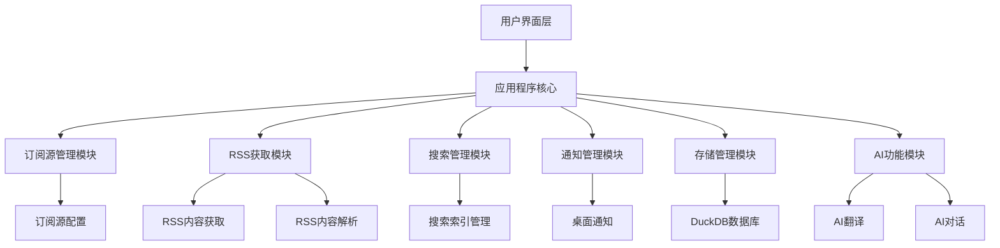
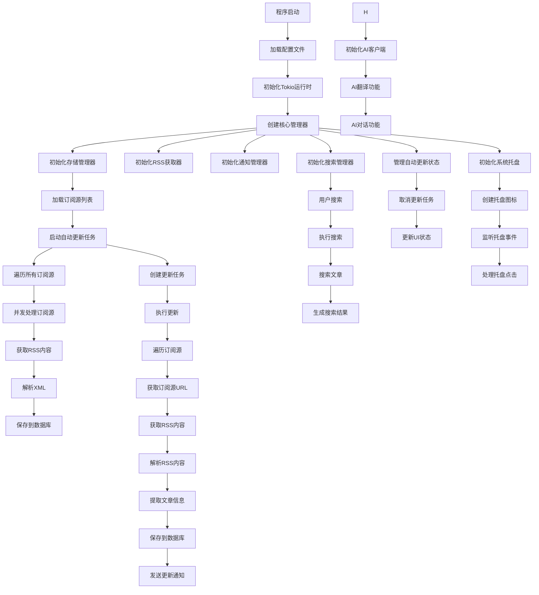
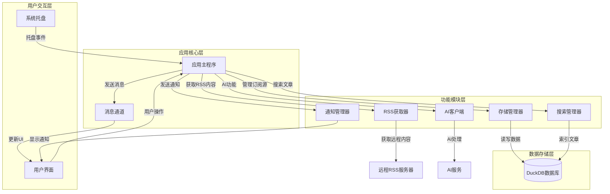
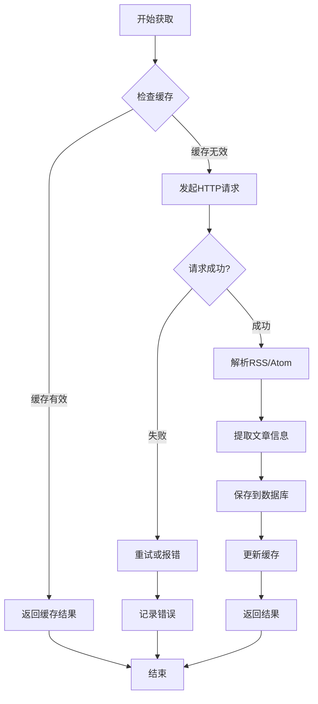
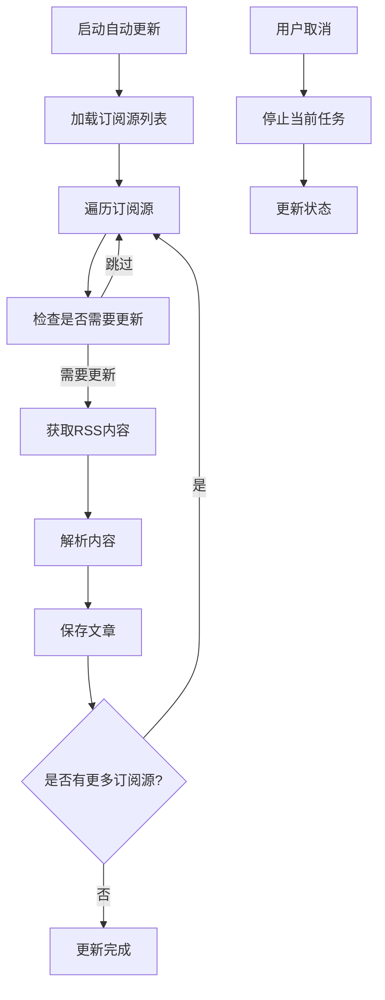
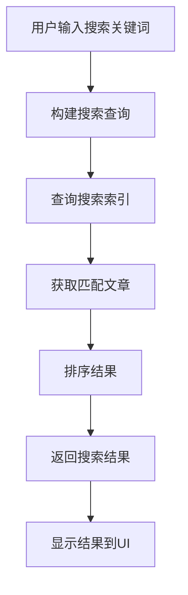
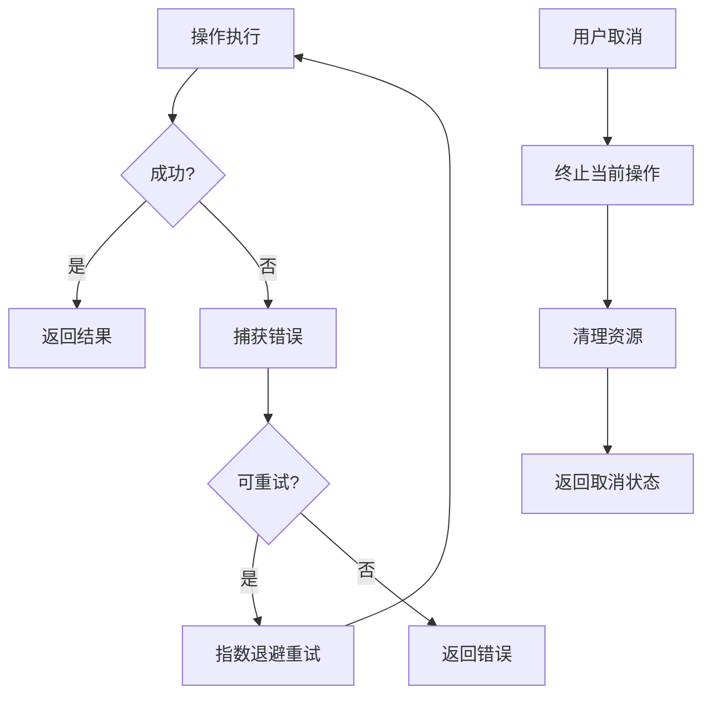
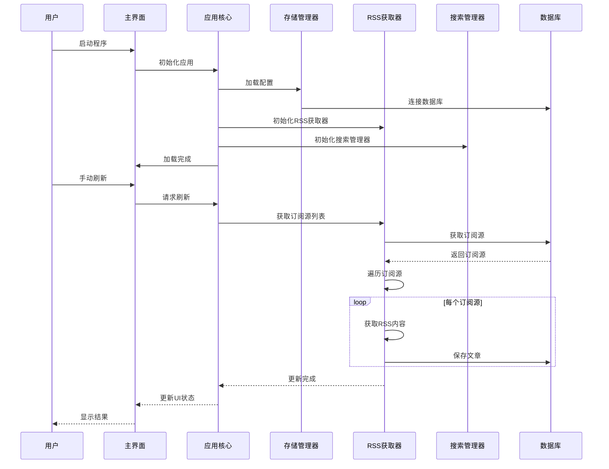

# Rust RSS阅读器运行原理流程图

## 系统架构概览

## 详细运行流程

## 核心组件交互图

## RSS获取流程

## 自动更新流程

## 搜索功能流程

## 技术栈与依赖关系

| 模块 | 主要功能 | 依赖技术 |
|------|----------|----------|
| 应用核心 | 程序主逻辑 | tokio, egui |
| RSS获取 | 订阅源内容获取 | reqwest, rss crate |
| 存储管理 | 数据持久化 | DuckDB |
| 搜索功能 | 文章搜索 | 自定义索引 |
| 通知系统 | 桌面通知 | 系统通知API |
| AI功能 | 翻译和对话 | 自定义AI客户端 |
| 系统托盘 | 后台运行支持 | tray_item |

## 关键设计特点

1. **异步优先**: 大量使用Tokio异步运行时，确保UI响应性
2. **模块化设计**: 清晰的模块划分，便于维护和扩展
3. **容错机制**: 完善的错误处理和重试逻辑
4. **并发优化**: 智能并发控制，根据CPU核心数调整
5. **用户体验**: 实时通知和状态反馈
6. **可扩展性**: 支持插件式架构，便于添加新功能

## 性能优化点

1. **缓存机制**: 智能缓存RSS获取结果，避免重复请求
2. **并发控制**: 基于Tokio的并发任务管理
3. **批处理**: 批量处理数据库操作，减少IO开销
4. **延迟加载**: 按需加载资源，提高启动速度
5. **索引优化**: 高效的搜索索引实现

## 错误处理机制

## 系统启动流程

